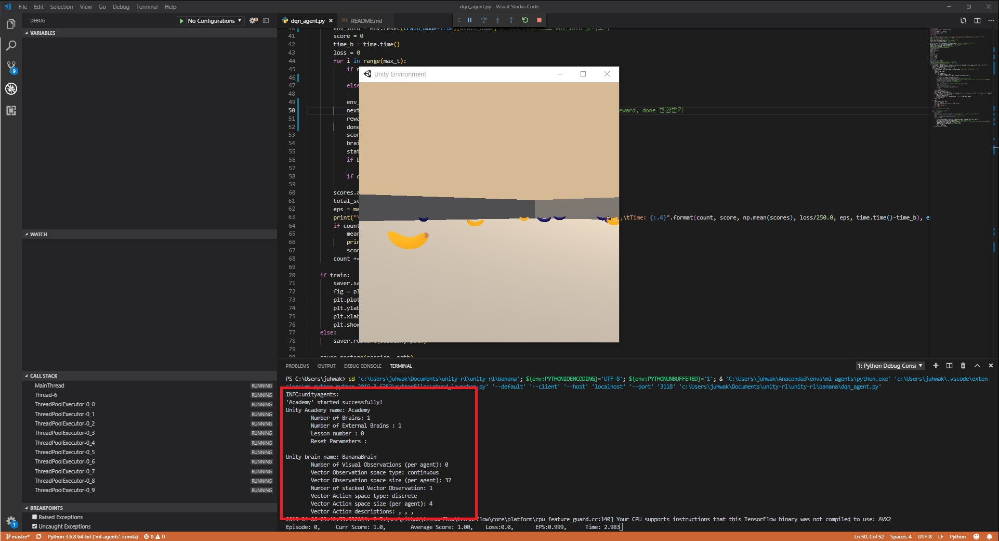

# Assignment

## 과제 내용

이번에는 자신이 원하는 환경을 고르고 자신이 사용하고 싶은 알고리즘을 사용해서 강화학습 시켜보는 것이 과제입니다.

만약 환경을 직접만드는것 이라면 docs 안에 유니티 ml-agents.ppt를 참고해주세요(ppt안 참고사이트에 유튜브를 보면 이해하기 편할겁니다.)

프로젝트가 있는경우는(Unity ml-agents의 Examples 폴더) Build_enviroment.md를 참고해주세요.

이제 어덯게 짜야할지 궁금하면 banana/dqn_agent.py를 열어서 확인하면 dqn를 사용한 예를 볼수있습니다.(주석중에 *가 있는것은 꼭필요한 것들입니다.)

만약 환경이 실행되면 아래와 위 그림과 같이 터미널에 환경에 대한 정보가 나오는데 

딥러닝 모델을 만들때 Action과 state의 Space size를 잘고려해서 만들어야 합니다.

위 그림을 보고 Action space type을 잘고려해서 알고리즘을 고르시길 바랍니다.

dqn예로 부족하다면 다른 Reacher,Tennis 폴더안에 예시들을 참고 해주시기 바랍니다.

